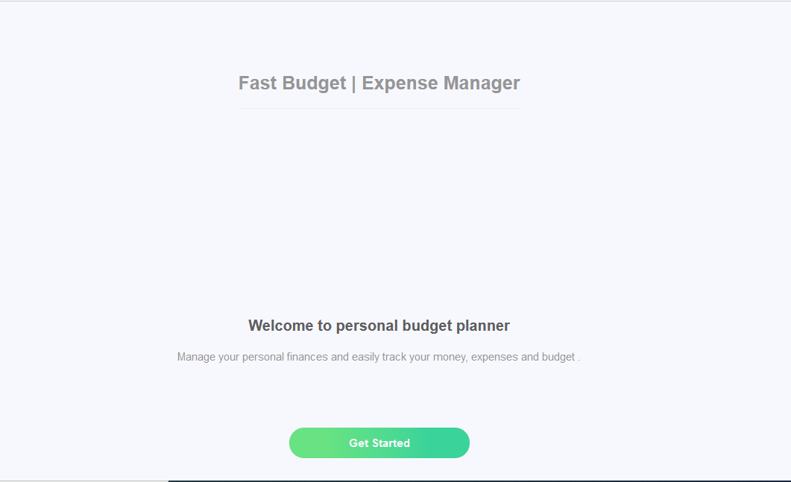
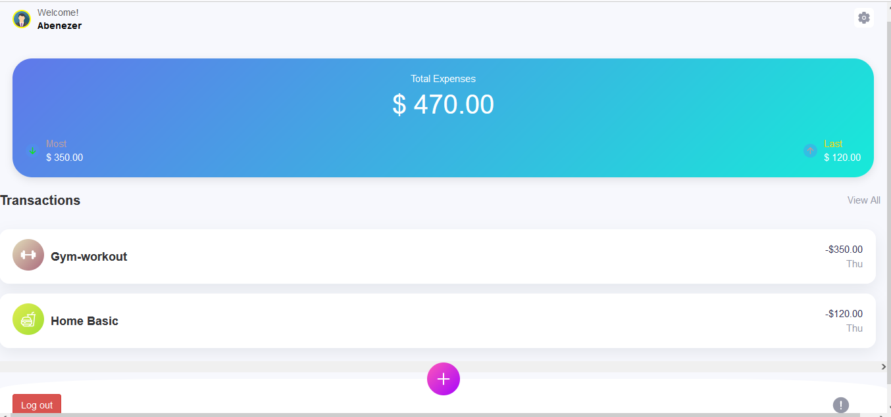

# Budget-app
> A Budget-app is mobile web application where you can manage your budget: you have a list of transactions associated with a category, so that you can see how much money you spent and on what.

> Splash Screen

> Home page

> The goal of the project is to build the RoR application using Ruby on Rails by ruby gems as software packages system.   
Click [Live](https://budget-app21.herokuapp.com/) to get a live preview of the project.

## EDR diagram

## Getting started

- Run `bundle install` to get the dependecies
- Run `rails db:create` to create a local database
- Run `rails db:migrate` to run migration 
- Run `rails s` to start  the server
- Open `https://localhost:3000` in your browser
- to run test `bundle exec rspec`

## Tests

Diffult (run all spec files):

`bundle exec rspec`

Run all spec files in the `Spec` folder:

`bundle exec rspec spec`

Run all spec files in a single directory:

`bundle exec rspec spec/models`

Run a single spec file:

`bundle exec rspec spec/integrations/login_spec.rb`

See all options for running specs:

`bundle exec rspec --help`

## Author

👤 **Abenezer Tilahun**

- GitHub: [Abenezer-Tilahun](https://github.com/Abenezer-Tilahun)
- Twitter: [@AbenezerTilahun11](https://twitter.com/AbenezerTilah11)
- LinkedIn: [@abenezer-tilahun](https://abenezer-tilahun.github.io/My-Portfolio/)

## 🤝 Contributing

Contributions, issues, and feature requests are welcome!

Feel free to check the [issues page](https://github.com/Abenezer-Tilahun/Budget-app/issues)

## Show your support

Give a ⭐️ if you like this project!

## Acknowledgments
- Microverse for the readme template
- Original design idea by [Gregoire Vella on Behance](https://www.behance.net/gregoirevella)

## 📝 License
This project is [MIT](./LICENSE) licensed